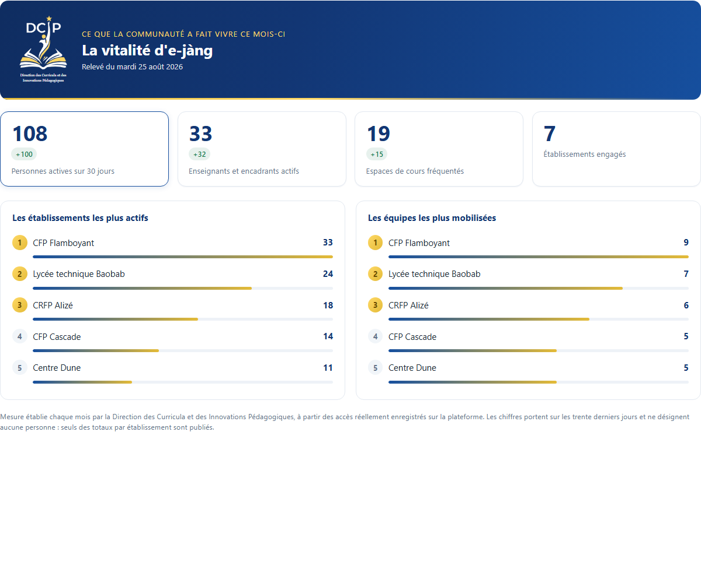

# Vitalité e-jàng, mesurer l'usage sans jamais désigner personne

Dispositif interne de mesure de l'usage d'**e-jàng**, la plateforme nationale de formation à distance du ministère de la Formation professionnelle et technique du Sénégal : des milliers d'espaces de cours, dont **une large part ne comptent qu'une seule personne inscrite**.

Sur un tel espace, publier une date de dernier accès revient à publier le comportement d'une personne identifiable en un clic. Le dispositif applique donc à une plateforme d'apprentissage les règles de la **statistique publique**, où elles sont la norme, alors qu'elles ne l'étaient pas ici.

Conçu au sein de la **Direction des Curricula et de l'Innovation Pédagogique (DCIP)**.

> 🟢 **En service** depuis août 2026. Relevé automatique le premier de chaque mois.

---

## En images

Quatre indicateurs, deux palmarès d'établissements, une note de méthode. Aucune personne n'y est nommée.

*Capture produite sur un banc de démonstration alimenté par des données fictives : les établissements portent des noms d'arbres et d'éléments naturels, précisément pour qu'aucune image ne puisse être confondue avec un établissement réel. Aucun chiffre de la plateforme n'est publié ici.*

---

## Ce qui le caractérise

- **🔒 Aucune donnée personnelle conservée** : les tables du dispositif ne portent aucun identifiant de personne, seulement des totaux.
- **🧮 Un masquage qui résiste à la déduction** : sous le seuil, la date de dernier accès, le nombre de personnes vues et le nombre d'inscriptions dormantes tombent **ensemble**, car chacune trahirait les deux autres.
- **➖ Un masquage qui résiste à la soustraction** : la règle de suppression secondaire de la statistique publique est appliquée : jamais une seule cellule supprimée dans une ligne.
- **🏫 Une émulation entre équipes, pas entre personnes** : le nombre d'enseignants actifs par établissement est publié, jamais leur nom.
- **⚡ Une seconde de collecte** pour l'ensemble de la plateforme : vingt-quatre indicateurs produits à partir de deux jeux de travail, agrégés en mémoire.
- **📱 Vérifié à la mesure, pas à l'œil** : le rendu sur téléphone est contrôlé par la largeur de débordement et la troncature des libellés, non par l'inspection visuelle.

---

## Deux publics, deux documents, une seule source de chiffres

**Ce qui mobilise va sur la place publique ; ce qui alerte reste dans le rapport interne.** Non pour farder les résultats, mais parce qu'un tableau de bord de communication et un instrument de pilotage ne se lisent pas de la même façon.

Le rapport interne comporte une première colonne qui indique le geste à poser : inscrire une classe, déposer du contenu, relancer les inscrits, vérifier dans le cours. Un tableau de chiffres sans verbe d'action finit dans un dossier.

---

## Le résultat qui n'était pas attendu

Confronté à la source de référence de la plateforme, le dispositif s'est révélé exact à une ou deux unités près, l'écart correspondant exactement aux comptes d'exploitation écartés volontairement.

Ce faisant, il a établi que **la mesure manuelle antérieure sous-estimait de près de moitié**. L'instrument n'a donc pas seulement remplacé un travail de plusieurs journées : il a montré que celui-ci voyait moins que la réalité.

---

## Voir la présentation

La page de présentation détaillée est disponible ici : **https://oumarsall3.github.io/vitalite-ejang/**

---

## À propos de ce dépôt

Ce dépôt **présente** le dispositif et la méthode. Il ne publie volontairement **ni son code source**, qui porte la structure d'un système d'information public, **ni aucun chiffre issu d'un relevé** : ni effectif, ni taux de remplissage, ni classement d'établissement. Ces chiffres appartiennent à l'institution qui exploite la plateforme. Leur publication est une décision qui lui revient.

Les seuls éléments de contexte conservés sont des ordres de grandeur de structure, sans lesquels le problème posé serait incompréhensible. Ils décrivent la difficulté à résoudre, non les résultats obtenus.

Ce qui est présenté ici est la méthode de protection. Elle ne doit rien à la plateforme concernée et vaut pour tout dispositif de mesure portant sur de petits effectifs.

**Conception :** Oumar SALL, Direction des Curricula et de l'Innovation Pédagogique, MEFPT, Sénégal.
